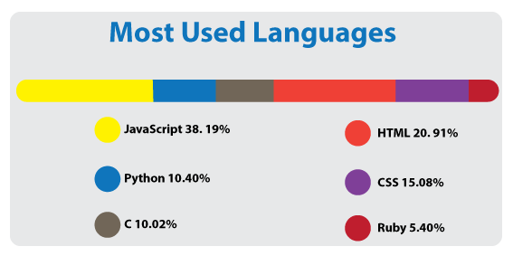
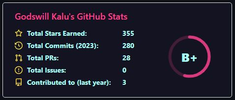

# Hi I'm Said.👋

### I'm a Software Engineer. `I learn by doing....`

- #### 🔭 I’m currently working on my coding skills.
- #### 👯 I’m open to collaborate on Software Engineering projects.

<h3 align="left">Languages and Tools:</h3>

<ul style="display:flex, flex-direction:row" align="center" class="collection">
    <li class="collection-item avatar">
      
      <a href="#!" class="secondary-content"><i class="material-icons">grade</i></a>
    </li>
    <li class="collection-item avatar">
      
      <a href="#!" class="secondary-content"><i class="material-icons">grade</i></a>
    </li>
    <li class="collection-item avatar">
      
      <a href="#!" class="secondary-content"><i class="material-icons">grade</i></a>
    </li>
    <li class="collection-item avatar">
      
      <a href="#!" class="secondary-content"><i class="material-icons">grade</i></a>
    </li>
    <li class="collection-item avatar">
     
      <a href="#!" class="secondary-content"><i class="material-icons">grade</i></a>
    </li>
    <li class="collection-item avatar">
      
      <a href="#!" class="secondary-content"><i class="material-icons">grade</i></a>
    </li>
    <li class="collection-item avatar">
       
      <a href="#!" class="secondary-content"><i class="material-icons">grade</i></a>
    </li>
    <li class="collection-item avatar">
      
      <a href="#!" class="secondary-content"><i class="material-icons">grade</i></a>
    </li>
    <li class="collection-item avatar">
     
      <a href="#!" class="secondary-content"><i class="material-icons">grade</i></a>
    </li>
    <li class="collection-item avatar">
     
      <a href="#!" class="secondary-content"><i class="material-icons">grade</i></a>
    </li>
    <li class="collection-item avatar">
     
      <a href="#!" class="secondary-content"><i class="material-icons">grade</i></a>
    </li>
    <li class="collection-item avatar">
     
      <a href="#!" class="secondary-content"><i class="material-icons">grade</i></a>
    </li>
    <li class="collection-item avatar">
      
      <a href="#!" class="secondary-content"><i class="material-icons">grade</i></a>
    </li>
    <li class="collection-item avatar">
     
      <a href="#!" class="secondary-content"><i class="material-icons">grade</i></a>
    </li>
    <li class="collection-item avatar">
    
      <a href="#!" class="secondary-content"><i class="material-icons">grade</i></a>
    </li>
    <li class="collection-item avatar">
     
      <a href="#!" class="secondary-content"><i class="material-icons">grade</i></a>
    </li>
    <li class="collection-item avatar">
     
      <a href="#!" class="secondary-content"><i class="material-icons">grade</i></a>
    </li>
    <li class="collection-item avatar">
     
      <a href="#!" class="secondary-content"><i class="material-icons">grade</i></a>
    </li>
    <li class="collection-item avatar">
     
      <a href="#!" class="secondary-content"><i class="material-icons">grade</i></a>
    </li>
  </ul>

## QUESTION AND ANSWER WEBSITE 
* [Stackoverflow](https://Stackoverflow.com/)
* [GitHub](https://github.com/)
* [Quora](https://quora.com/)
* [Reddit](https://reddit.com/)
* [Stack exchange](https://Stackexchange.com/)
* [Code project](https://codeproject.com/)
* [Programmers heaven](https://programmersheaven.com/)

# Contact 

* [LinkedIn](https://www.linkedin.com/in/elsaaeid-ellithy-9017811b2/)        [Portfolio](https://elsaaeid.github.io/portfolio-react/)        [Behance](https://www.behance.net/elsaeedellisy1)        [Email](mailto:saidsadaoy@gmail.com) 
